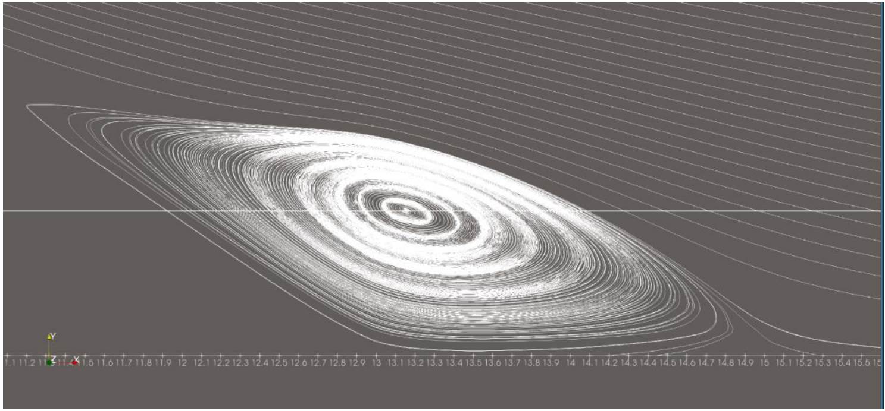

# CFD-Analysis-of-Flow-Separation-and-Reattachment
A 2D CFD study of steady, laminar, incompressible flow through an asymmetric channel with inclined expansion and contraction, performed using **OpenFOAM v14**.

The study investigates the effects of **mesh resolution** and **Reynolds number** on flow separation, reattachment, recirculation, and vortex characteristics.

## Objectives

- Investigate flow separation and reattachment in an inclined expansion channel
- Perform a mesh-independence study
- Quantify separation and reattachment using wall shear stress
- Analyze recirculation-region and vortex characteristics
- Study Reynolds-number effects for **Re = 60, 80, and 100**
- Automate case setup and execution using Bash

## Methodology

| Parameter | Details |
|---|---|
| Solver | OpenFOAM v14 |
| Flow | Steady, laminar, incompressible |
| Geometry | 2D asymmetric channel with inclined expansion/contraction |
| Reynolds numbers | 60, 80, 100 |
| Mesh | Structured hexahedral |
| Mesh sizes | 3,933 / 15,390 / 61,560 cells |
| Pressure-velocity coupling | SIMPLE |
| Meshing | `blockMesh` |
| Post-processing | ParaView |
| Automation | Bash |

Separation and reattachment locations were identified from **zero crossings of the streamwise wall shear stress**. The primary recirculation vortex was characterized using the reverse-flow region and minimum streamwise velocity.

## Key Results

### Mesh Independence — Re = 60

| Mesh | Cells | Reattachment Length | Wall Footprint |
|---|---:|---:|---:|
| Coarse | 3,933 | 3.570 | 1.75 |
| Medium | 15,390 | 3.610 | 1.75 |
| Fine | 61,560 | 3.630 | 1.81 |

The medium-to-fine mesh change in reattachment length was approximately **0.55%**.

### Reynolds-Number Study

| Re | Reattachment Length | Total Wall Footprint |
|---:|---:|---:|
| 60 | 3.630 | 1.81 |
| 80 | 4.335 | 3.125 |
| 100 | 5.070 | 4.57 |

The reattachment length and total recirculation footprint increased with Reynolds number over the investigated range.

## Verification

Numerical verification was performed through:

- Mesh-independence analysis
- Residual convergence
- Global continuity monitoring

The reported global continuity error was approximately **−9.24 × 10⁻¹⁶**.

Direct experimental validation was not performed because a matching reference geometry and Reynolds-number definition could not be established with sufficient confidence.

## Disclaimer

This project was developed as part of a **FOSSEE, IIT Bombay** semester-long internship selection task.

## Repository Structure

```text
.
├── README.md
├── report/
│   └── Dhruva_C_Fluid_Mech_FOSSEE.pdf
├── cases/
│   ├── Re60/
│   ├── Re80/
│   └── Re100/
├── scripts/
└── results/
